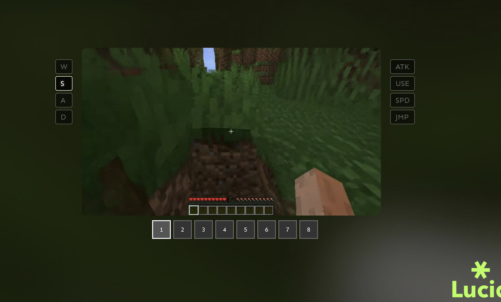

# Lucid v1, "latent world model"


This is an inference script with full interactive realtime play (and web ui), it contains a couple of maps and more will be added soon, this is compatible with RTX 4090-grade gpus (upto 30fps), you can adjust context length and sampling steps to increase fidelity, optimized/default setting now should run at 20fps


## How to install

### Ubuntu / Debian

#### Prerequisite
```bash
sudo apt-get install libgl1 unzip 
```
Please make sure to have opencv, unzip, and nvidia cuda driver installed, [use this link to install cuda](https://developer.nvidia.com/cuda-12-0-0-download-archive)

#### Installation
```bash
sudo chmod +x ./setup.sh
./setup.sh
```
the setup script should install all the necessary files, pls check nvidia-smi again before proceeding, and currently i'm releasing support only for cuda 12.0

#### Launch 
```bash
python3 launch.py --port 3000
```